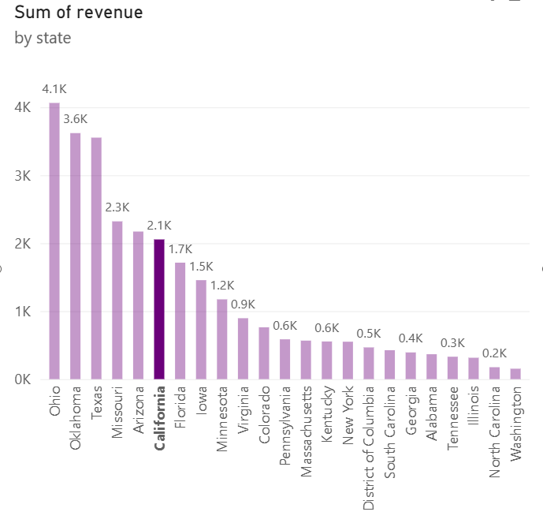
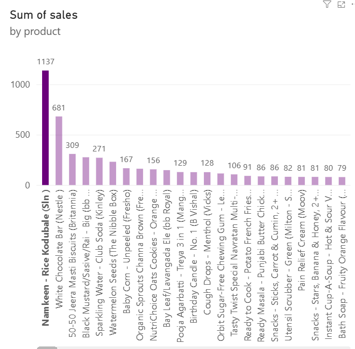
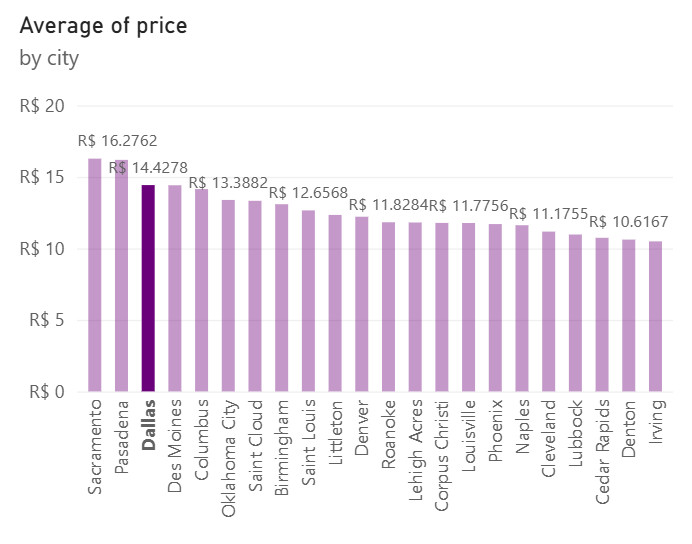

# sales-data-cleaning-powerbi
Data cleaning, table relationship modeling, and sales metric calculation using Power BI and Power Query.
# 🛒 Sales Analysis - Data Cleaning & Relationship Modeling

## 🎯 Project Overview
This project focuses on resolving data inconsistencies, establishing proper table relationships, and calculating key business performance metrics (KPIs) using **Power BI** and **Power Query**.

## 🛠️ Technologies & Tools

  

## 📊 Business Questions & Key Insights

Here are the results derived from the cleaned data model:

* **What is the total revenue in California?**  
  👉 **$2,1k**

* **How many sales were made for the product "Namkeen - Rice Kodubale (Sln)"?**  
  👉 **1137 sales**

* **What is the average product price in Dallas?**  
  👉 **$14.43** (exact: $14.4278)

---

## 🧹 Technical Highlights & ETL Steps

## 🧹 Technical Highlights & ETL Steps (Power Query)

1. **Value Replacement (`Replace Values`):** Standardized data entries by correcting typos and spacing inconsistencies (e.g., replacing `verylow` with `very low`).
2. **Text Cleaning (`Trim` & `Clean`):** Applied `Trim` to remove unwanted leading/trailing whitespaces, and `Clean` to eliminate non-printable characters.
3. **Column Splitting (`Split Column`):** Split composite text columns by delimiters to isolate distinct product attributes into standalone fields.
4. **Substring Extraction (`Extract`):** Utilized text extraction features to parse specific length/depth/width dimensions from raw product strings.
5. **Unit Conversion (`Standard` Operations):** Applied standard mathematical transformations in Power Query to convert measurements into inches.
6. **Regional & Date Formatting (`Using Locale`):** Handled regional setting mismatches for dates and decimal separators (converting dot/comma notations and day/month/year order seamlessly).
7. **Data Modeling:** Built active relationships between the sales fact table and product/location dimension tables.

---

## 🖼️ Dashboard / Visual Preview

### 1. Total Revenue in California

### 2. Product Sales: "Namkeen - Rice Kodubale (Sln)"

### 3. Average Price in Dallas

